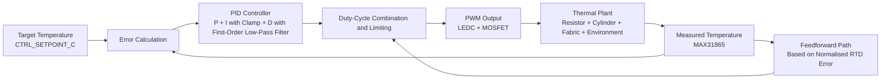

# thermal_pid_control

An ESP-IDF-based closed-loop heating control project. The MAX31865 is used to read the RTD temperature, while the LEDC PWM peripheral drives a MOSFET to control the heating resistor. The main controller combines PID control with feedforward compensation.

## 1. Directory Structure

* `main/main.c`: Main control process, including sampling, feedforward calculation, PID control, protection, and output
* `main/max31865_ctrl.c/.h`: MAX31865 SPI driver and temperature conversion
* `main/pwm_ctrl.c/.h`: LEDC PWM initialisation and duty-cycle output

## 2. Hardware Connections

* MAX31865 to ESP32 via SPI

  * `MOSI` -> `CTRL_SPI_MOSI_GPIO`
  * `MISO` -> `CTRL_SPI_MISO_GPIO`
  * `SCLK` -> `CTRL_SPI_SCLK_GPIO`
  * `CS` -> `CTRL_SPI_CS_GPIO`

* MOSFET driver

  * ESP32 PWM output -> MOSFET gate through a series gate resistor
  * The heating resistor, power supply, and MOSFET drain-source path are connected in a low-side switching configuration
  * The PWM output pin is specified by `CTRL_PWM_GPIO`

## 3. Control Logic

The following steps are performed during each control cycle:

1. Take a single MAX31865 sample to obtain `r_rtd` and `temp_c`.
2. Update `ambient_rtd_est` in the low-temperature range to correct the ambient reference resistance.
3. Calculate the normalised resistance error `res_error_norm` and generate the feedforward term `ff`.
4. Apply the temperature error to the PID controller to obtain the closed-loop correction term `pid_out`.
5. Dynamically limit the maximum duty cycle to reduce overshoot near the target temperature.
6. Apply over-temperature protection. When `temp >= setpoint + safety_margin`, force the duty cycle to 0 and reset the integral term.
7. Output the PWM duty cycle and print the control log.



## 4. Parameter Configuration in `main.c`

Key parameters include:

* Sensor parameters:

  * `CTRL_RTD_NOMINAL_OHMS`
  * `CTRL_RTD_REF_OHMS`
  * `CTRL_FILTER_50HZ`

* Control period and target:

  * `CTRL_SAMPLE_MS`
  * `CTRL_SETPOINT_C`

* Ambient parameters:

  * `CTRL_AMBIENT_C`
  * `CTRL_AMBIENT_RTD_OHMS_MAX`

* PID parameters:

  * `CTRL_PID_KP`
  * `CTRL_PID_KI`
  * `CTRL_PID_KD`

* PID stability parameters:

  * `CTRL_PID_I_LIMIT`: Integral-term clamp
  * `CTRL_PID_D_LPF_TAU_S`: Low-pass filter time constant for the derivative term

* Feedforward and output limiting:

  * `CTRL_KFF`
  * `CTRL_MAX_DUTY_PERCENT`

* Protection parameter:

  * `CTRL_SAFETY_MARGIN_C`

## 5. Build and Flash

Run the following commands in the project directory `firmware/thermal_pid_control`:

```bash
idf.py set-target esp32
idf.py build
idf.py flash monitor
```

## 6. Tuning Recommendations

* During initial tuning, reduce `Ki` first. Adjust `Kp` so that the system approaches the target temperature quickly without causing excessive overshoot.
* If measurement noise is significantly amplified, reduce `Kd` or moderately increase `CTRL_SAMPLE_MS`.
* If the initial heating stage is too slow, moderately increase `CTRL_KFF`.
* If overshoot is significant, reduce `CTRL_MAX_DUTY_PERCENT` or increase `CTRL_SAFETY_MARGIN_C`.
