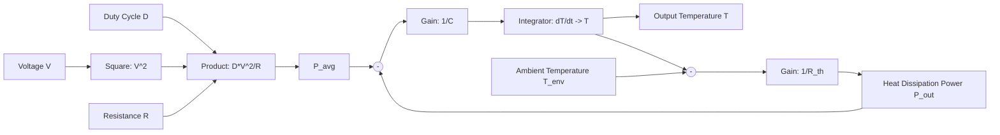

# Simulink Simulation Experiment (Resistor PWM Thermal Model)

## 1. Experimental Background and Objectives

The main objective of this experiment is to establish an electrothermal coupled model to describe the heating process of a resistor under PWM control and to observe how its temperature changes over time.

Compared with direct circuit simulation, this method focuses more on system modelling. Instead of analysing every transient detail of the PWM waveform, the model considers its equivalent effect on the thermal system. This experiment can be used to verify the relationships between duty cycle, power, and temperature, while also demonstrating how thermal capacity and heat dissipation affect the dynamic behaviour of the system.

---

## 2. Basic Principles

Under PWM control, the heat generated by the resistor can be represented by an average power input rather than instantaneous power. The average power is expressed as:

$$ P_{avg} = \frac{D \cdot V^2}{R} $$

where $D$ is the duty cycle, $V$ is the voltage, and $R$ is the resistance.

From a thermal perspective, the whole system can be represented by an equivalent thermal RC model:

$$ C \cdot \frac{dT}{dt} = P_{avg} - \frac{T - T_{env}}{R_{th}} $$

**Parameter definitions:**

* $C$: **Thermal Capacity**, measured in J/K. It represents the ability of the system to store thermal energy and is similar to capacitance in an electrical circuit. A larger value of $C$ results in a slower temperature change over time.
* $R_{th}$: **Thermal Resistance**, measured in K/W. It represents the resistance to heat transfer from the system to the environment and is similar to resistance in an electrical circuit. A larger value of $R_{th}$ means that the system retains heat more effectively and reaches a higher final steady-state temperature.
* $T$: Current system temperature.
* $T_{env}$: Ambient temperature.
* $\frac{dT}{dt}$: Rate of temperature change over time.

This equation essentially represents a first-order system that describes the dynamic balance between input power and heat dissipation.

When the system reaches a steady state, the temperature no longer changes, so $\frac{dT}{dt} = 0$. The final steady-state temperature can therefore be calculated as:

$$ T_{final} = T_{env} + P_{avg} \cdot R_{th} $$

This result is very important because the simulation results must later be compared with this theoretical value.

---

## 3. Parameter Settings and Theoretical Calculations

To keep the model simple and easy to verify, the following parameters are used:

* Voltage: $V = 5\text{V}$
* Resistance: $R = 10\Omega$
* Ambient temperature: $T_{env} = 25^\circ\text{C}$
* Thermal capacity: $C = 50\text{J/K}$
* Thermal resistance: $R_{th} = 10\text{K/W}$

The calculations for different duty cycles are shown below.

**1. When $D = 0.1$:**

$$ P = \frac{0.1 \times 25}{10} = 0.25\text{W} $$

$$ T_{final} = 25 + 0.25 \times 10 = 27.5^\circ\text{C} $$

**2. When $D = 0.5$:**

$$ P = \frac{0.5 \times 25}{10} = 1.25\text{W} $$

$$ T_{final} = 25 + 1.25 \times 10 = 37.5^\circ\text{C} $$

These values will be used as reference values for comparison with the simulation results.

---

## 4. Simulink Modelling Process (Detailed Steps)

In Simulink, the complete system can be divided into three main sections: the **input layer**, the **power calculation layer**, and the **thermal RC physical model layer**.

### 4.1 Block Locations and Preparation (Library Browser)

* **Constant** (Simulink/Sources): Used to define $D$, $V$, $R$, and $T_{env}$.
* **Product** (Simulink/Math Operations): Used for multiplication and division.
* **Square** (Simulink/Math Operations): Used to calculate $V^2$.
* **Sum** (Simulink/Math Operations): Used to calculate $P_{in} - P_{out}$ and $T - T_{env}$.
* **Gain** (Simulink/Math Operations): Used to implement $1/C$ and $1/R_{th}$.
* **Integrator** (Simulink/Continuous): The main block used to integrate $\frac{dT}{dt}$ and obtain the temperature $T$.
* **Scope / To Workspace** (Simulink/Sinks): Used to observe and save the temperature curve.

### 4.2 Logical Connection Process

1. **Power Calculation**:

   * Connect the voltage $V$ to the **Square** block to obtain $V^2$.
   * Connect $V^2$ and the duty cycle $D$ to a **Product** block for multiplication.
   * Divide the result by the resistance $R$ using another **Product** block, or multiply it by $1/R$, to obtain the average power $P_{avg}$.

2. **Thermal Core**:

   * **Sum Block (1)**: Calculates $(P_{avg} - P_{out})$.
   * **Gain Block (1)**: Multiplies the result by $1/C$ to obtain $\frac{dT}{dt}$.
   * **Integrator Block**: Integrates $\frac{dT}{dt}$. **Note:** Set the initial value in the Integrator properties to $T_{env}$, such as 25.
   * **Sum Block (2)**: Calculates the temperature difference between the current temperature $T$ and the ambient temperature $T_{env}$, which is $(T - T_{env})$.
   * **Gain Block (2)**: Multiplies the temperature difference by $1/R_{th}$ to obtain the heat dissipation power $P_{out}$. This signal is then fed back to the negative input of **Sum Block (1)**.

3. **Result Output**:

   * Connect the output of the Integrator block to the **Scope**.

### 4.3 Model Structure Diagram (Equivalent Logic)

---

## 5. Experimental Procedure

The experiment can be carried out in several stages.

The first stage is a basic heating experiment. Set a fixed duty cycle, such as 0.1, and observe the temperature rising gradually from the ambient temperature until it reaches a steady state. Record the steady-state value and compare it with the theoretical result.

The second stage is a comparison experiment using multiple duty cycles. Set several duty-cycle values, such as 0.01, 0.1, and 0.5, and observe multiple temperature curves at the same time. It can be clearly seen that a higher duty cycle produces a higher final temperature.

The next stage is a cooling experiment. Maintain a relatively high duty cycle, such as 0.5, for a period of time and then suddenly reduce the duty cycle to 0. The system will stop generating heat, leaving only the heat dissipation process. A typical exponential cooling curve can then be observed.

Finally, the model parameters can be adjusted. For example, increasing the thermal capacity or thermal resistance makes it possible to observe their effects directly. A larger thermal capacity results in a slower temperature change, while a larger thermal resistance improves heat retention and produces a higher temperature.

---

## 6. Result Analysis

Several clear conclusions can be obtained from the simulation.

First, the temperature response follows the behaviour of a first-order system. Both the heating and cooling processes have an exponential form.

Second, the duty cycle directly determines the final temperature by controlling the average input power. It is therefore the main control variable of the system.

In addition, thermal capacity and thermal resistance affect the dynamic speed and steady-state temperature of the system, respectively. Together, they determine the overall behaviour of the thermal system.

Most importantly, the simulation results should be generally consistent with the theoretical calculations. This agreement confirms that the model is correct.

---

## 7. Extensions and Further Considerations

After completing the basic experiment, several extensions can be explored.

For example, a real PWM waveform can be used instead of the average power input, and the two models can then be compared. In theory, their temperature responses should be almost identical because the thermal system has low-pass characteristics.

A nonlinear heat dissipation model can also be introduced so that heat loss has a nonlinear relationship with the temperature difference. This would make the model more representative of a real physical environment.

For further engineering applications, the model can be extended to the thermal analysis of MOSFETs, motors, and other devices.

---

## 8. Conclusion

This experiment starts with a simple resistor and establishes a complete electrothermal coupled model, which is then verified using Simulink.

The results show that:

* PWM can be represented as an equivalent average power input.
* A thermal system is essentially a first-order inertial system.
* The duty cycle determines the steady-state temperature.
* Thermal capacity and thermal resistance determine the dynamic characteristics of the system.

This method is not only suitable for this experiment but can also be applied to the thermal design of more complex electronic systems.
