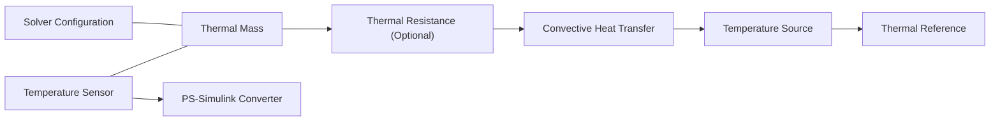

# Simulink Preliminary Simulation Experiment (Thermal Module Approach)

## 1. Basic Principles (Why Thermal Modules Are Used)

* The cylinder can be approximated as a lumped thermal-capacitance node. When Bi < 0.1, it can be treated as a first-order system.
* Convective heat transfer is determined by hA, while the fabric can be represented as an additional thermal resistance, R_fabric.
* Thermal modules make these quantities explicit: Thermal Mass represents C, Convective Heat Transfer represents hA, and Thermal Resistance represents R_fabric.

## 2. Verification Experiments That Can Be Conducted (Preliminary Test Objectives)

* Natural cooling verification: keep h constant and verify that the temperature decays exponentially over time.
* Wind-speed effect verification: change v and observe whether the increase in the equivalent h value accelerates cooling.
* Fabric effect verification: add R_fabric and compare the cooling behaviour with and without fabric.
* Wet-condition effect verification: allow R_fabric to vary over time and observe how the slope of the cooling curve changes.

## 3. Experimental Procedure (Thermal Module Construction and Parameter Settings)

### 3.1 Component Locations (Simscape Paths)

* Thermal Mass: Simscape > Foundation Library > Thermal > Thermal Elements. This is equivalent to “thermal capacity”. It stores heat and determines how quickly the temperature rises or falls.
* Thermal Resistance: Simscape > Foundation Library > Thermal > Thermal Elements. This is equivalent to an “insulation layer”. It resists heat flow, and a larger value provides better thermal insulation.
* Convective Heat Transfer: Simscape > Foundation Library > Thermal > Thermal Elements. This simulates “convective heat loss to air” and is determined by the area A and the heat-transfer coefficient h.
* Temperature Source: Simscape > Foundation Library > Thermal > Thermal Sources. This provides the ambient temperature and is equivalent to “external air maintained at a constant temperature”.
* Temperature Sensor: Simscape > Foundation Library > Thermal > Thermal Sensors. This acts as a temperature probe and outputs the cylinder temperature to Simulink.
* Thermal Reference: Simscape > Foundation Library > Thermal > Thermal References. This is the thermal “ground” and is a required reference point for all thermal networks.
* Solver Configuration: Simscape > Utilities. This is the simulation solver interface that tells Simscape how to calculate the thermal network. One must be included.
* Simulink-PS Converter / PS-Simulink Converter: Simscape > Utilities. These convert between Simulink signals and physical signals and are used to input wind speed or thermal resistance and output temperature.

### 3.2 Connection Method (From the Heat Source to the Environment)

### 3.3 Parameter Settings (Minimum Values for a Working Model)

* Thermal Mass: mass m and specific heat capacity c
* Convective Heat Transfer: area A and convective heat-transfer coefficient h
* Temperature Source: ambient temperature T_env
* Thermal Resistance: fabric thermal resistance R_fabric

### 3.3.1 Example Cylinder Parameter Calculation

(Outer Diameter 5 cm, Inner Diameter 2 cm, Length 10 cm, Pure Copper)

* Outer radius R_o = 0.025 m, inner radius R_i = 0.01 m, length L = 0.1 m
* Volume V = pi(R_o^2 - R_i^2)L ≈ 1.649 × 10^-4 m^3
* Density rho = 8960 kg/m^3
* Mass m = rhoV ≈ 1.48 kg
* Specific heat capacity c = 385 J/(kg·K)
* Thermal capacity C = m·c ≈ 569 J/K

### 3.3.2 Calculation of Convective Area A

(External Surface)

* Side area A_side = 2piR_oL ≈ 0.01571 m^2
* End area A_end = 2pi(R_o^2 - R_i^2) ≈ 0.00330 m^2
* Total area A ≈ 0.01901 m^2

### 3.3.3 Example Conductive Heat Transfer Parameters

(Radial Heat Conduction Through the Copper Wall)

* Thermal conductivity k = 401 W/(m·K)
* Wall thickness L_wall = R_o - R_i = 0.015 m
* Equivalent conductive area A_cond = 2piR_mL, where R_m = (R_o + R_i)/2 = 0.0175 m
* A_cond ≈ 0.010996 m^2
* Equivalent thermal resistance R_cond = L_wall/(k·A_cond) ≈ 3.41 × 10^-3 K/W
* Module settings: Thermal conductivity = k, Area = A_cond, Length = L_wall

### 3.4 Implementation of Wind-Speed Input

1. Use Simulink to calculate h(v) = h_0 + k·v^n. A linear relationship can be used initially.
2. Connect the output to the h port of the Convective Heat Transfer block through a Simulink-PS Converter.

### 3.5 Implementation of Wet-Condition Input

1. Use a Step block or Lookup Table to generate R_fabric(t).
2. Connect the output to the R port of the Thermal Resistance block through a Simulink-PS Converter.

## 4. Experimental Verification Steps (Operating Sequence)

### 4.1 Natural Cooling Baseline

* Keep h constant and remove R_fabric.
* Observe whether T(t) follows an exponential decay.
* Record the baseline value of tau.

### 4.2 Wind-Speed Effect

* Set v to several step values.
* Observe whether the cooling curve becomes steeper.
* Fit the parameters h_0, k, and n.

### 4.3 Fabric Effect

* Add a constant R_fabric.
* Compare the temperature curves with and without fabric.

### 4.4 Wet-Condition Effect

* Allow R_fabric(t) to decrease over time.
* Observe the trend in which cooling is slower at the beginning and becomes faster later.

## 5. Expected Results (Acceptance Criteria)

* Curve shape: natural cooling should follow an exponential decay.
* Wind-speed effect: as wind speed increases, the time constant tau should decrease.
* Fabric effect: adding R_fabric should slow the cooling process.
* Wet-condition effect: as R_fabric(t) decreases, the slope of the cooling curve should gradually increase.
